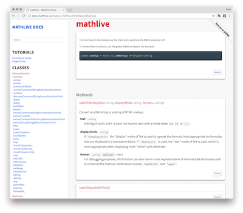

# Sutro

A clean, responsive, documentation template theme for JSDoc 3.

Based on [Namis](https://github.com/hungluu2106/namis), which is based on
based on [Minami](https://github.com/Nijikokun/minami).



## Uses

- Source Sans Pro and Source Code Pro typefaces by Adobe.
- [the Taffy Database library](http://taffydb.com/)
- [Underscore Template library](http://underscorejs.org)

## Install

```bash
$ npm install --save-dev sutro-jsdoc-theme
```

## Usage

```bash
$ jsdoc entry-file.js -t node_modules/sutro-jsdoc-theme
```

You can customize the template in your `jsdoc.conf.json` file:
```json
{
    "tags": {
        "allowUnknownTags": true,
        "dictionaries": ["jsdoc","closure"]
    },
    "source": {
        "include": "./src/",
        "includePattern": ".+\\.js$",
        "excludePattern": "(^|\\/|\\\\)_"
    },
    "plugins": [
        "plugins/markdown"
    ],
    "templates": {
        "cleverLinks": false,
        "monospaceLinks": false,
        "outputSourceFiles": true,
        "linenums": true,
        "includeDate": false,
        "title": "MathLive",
        "pageTitle": "MathLive Docs",
        "description": "Beautifully typeset math made easy",
        "keywords": "latex, tex, math, typesetting, documentation, docs",
        "forkme": "https://github.com/arnog/mathlive"
    },
    "opts": {
        "access": "all",        //  use "public" to ommit the private symbols
        "template": "node_modules/sutro-jsdoc-theme",
        "encoding": "utf8",               // same as -e utf8
        "recurse": true,                  // same as -r
        "destination": "./docs",
        "readme": "CONTRIBUTOR_GUIDE.md", // this will be displayed as the "home pagfe" of the documentation
        "sort": false
    }
}
```

The following keys in the `templates` section are specific to Sutro:
- `cleverLinks` 
- `monospaceLinks`
- `outputSourceFiles`: if `true`, include prettyfied source files in
the documentation
- `linenums`: if `true`, include line numbers in prettyfied output
- `includeDate`: if `true`, include date of documentation creation 
in footer
- `title`: name of the "home" link, at the top left of the page
- `pageTitle`: value of the `<title>` tag
- `description`: value of the `<description>` tag
- `keywords`: value of the `<keywords>` tag
- `forkme`: if present, display a "Fork Me" banner, with a URL pointing to the value of this entry

## License

Licensed under the Apache2 license.

