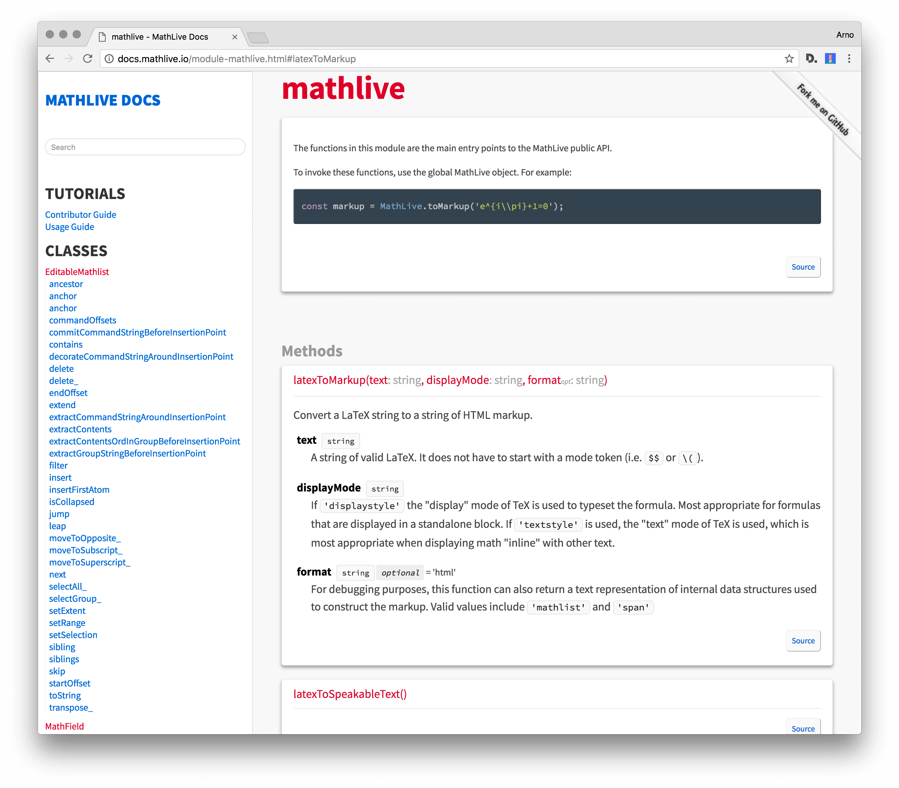

# Sutro

A clean, responsive documentation template theme for JSDoc 3, based on 
[Namis](https://github.com/hungluu2106/namis), 
based on [Minami](https://github.com/Nijikokun/minami)



## Uses

- Source Sans Pro and Source Code Pro fonts
- [the Taffy Database library](http://taffydb.com/)
- [Underscore Template library](http://documentcloud.github.com/underscore/#template)

## Install

```bash
$ npm install --save-dev sutro-jsdoc-theme
```

## Usage

```bash
$ jsdoc entry-file.js -t node_modules/sutro-jsdoc-theme
```

## License

Licensed under the Apache2 license.

